# Database

PostgreSQL 15+. Schema is managed by Flyway:

- `V1__init_schema.sql` — ground truth schema (23 tables). **Do not edit.**
- `V2__seed_data.sql` — deterministic demo data for "Green Valley Society".

All primary keys are `UUID` (generated with `gen_random_uuid()`, via the `pgcrypto` extension,
unless a fixed literal is supplied by seed data). All tables use `TIMESTAMPTZ` for
created/updated/audit timestamps.

## Entity-Relationship Diagram

```mermaid
erDiagram
    SOCIETIES ||--o{ BLOCKS : "has"
    SOCIETIES ||--o{ USERS : "employs/houses"
    SOCIETIES ||--o{ STAFF : "employs"
    SOCIETIES ||--o{ VISITORS : "scopes"
    SOCIETIES ||--o{ NOTICES : "publishes"
    SOCIETIES ||--o{ COMPLAINTS : "scopes"
    SOCIETIES ||--o{ INVOICES : "scopes"
    SOCIETIES ||--o{ AMENITIES : "offers"

    BLOCKS ||--o{ FLATS : "contains"

    FLATS ||--o{ RESIDENTS : "houses"
    FLATS ||--o{ VISITORS : "destination of"
    FLATS ||--o{ INVOICES : "billed to"
    FLATS ||--o{ STAFF_FLAT_ASSIGNMENTS : "assigned to"

    USERS ||--o{ PASSWORD_RESET_TOKENS : "requests"
    USERS ||--o{ REFRESH_TOKENS : "holds"
    USERS ||--|| RESIDENTS : "is (1:1)"
    USERS |o--o| STAFF : "is (optional login)"
    USERS ||--o{ NOTICES : "publishes"
    USERS |o--o{ VISITORS : "approves"
    USERS |o--o{ VISITORS : "checks in"
    USERS ||--o{ COMPLAINT_COMMENTS : "writes"
    USERS |o--o{ PAYMENTS : "records"
    USERS ||--o{ CHAT_CONVERSATIONS : "owns"
    USERS ||--o{ NOTIFICATIONS : "receives"
    USERS |o--o{ AUDIT_LOGS : "performs"

    RESIDENTS ||--o{ FAMILY_MEMBERS : "has"
    RESIDENTS |o--o{ VISITORS : "hosts"
    RESIDENTS ||--o{ COMPLAINTS : "raises"
    RESIDENTS ||--o{ AMENITY_BOOKINGS : "books"

    STAFF ||--o{ STAFF_FLAT_ASSIGNMENTS : "assigned via"
    STAFF ||--o{ STAFF_ATTENDANCE : "clocks"
    STAFF |o--o{ COMPLAINTS : "resolves"

    COMPLAINTS ||--o{ COMPLAINT_COMMENTS : "has"

    INVOICES ||--o{ PAYMENTS : "settled by"

    AMENITIES ||--o{ AMENITY_BOOKINGS : "booked via"

    CHAT_CONVERSATIONS ||--o{ CHAT_MESSAGES : "contains"

    SOCIETIES {
        uuid id PK
        varchar name
        varchar registration_no
        varchar address_line1
        varchar address_line2
        varchar city
        varchar state
        varchar pincode
        varchar contact_email
        varchar contact_phone
        text amenities_summary
        varchar logo_url
        timestamptz created_at
        timestamptz updated_at
    }
    BLOCKS {
        uuid id PK
        uuid society_id FK
        varchar name
        int total_floors
        timestamptz created_at
    }
    FLATS {
        uuid id PK
        uuid block_id FK
        varchar flat_number
        int floor
        varchar flat_type
        numeric area_sqft
        varchar status
        timestamptz created_at
    }
    USERS {
        uuid id PK
        uuid society_id FK "nullable"
        varchar email UK
        varchar password_hash
        varchar first_name
        varchar last_name
        varchar phone
        varchar role "CHECK enum"
        varchar status "CHECK enum"
        varchar avatar_url
        timestamptz last_login_at
        timestamptz created_at
        timestamptz updated_at
    }
    PASSWORD_RESET_TOKENS {
        uuid id PK
        uuid user_id FK
        varchar token UK
        timestamptz expires_at
        boolean used
        timestamptz created_at
    }
    REFRESH_TOKENS {
        uuid id PK
        uuid user_id FK
        varchar token UK
        timestamptz expires_at
        boolean revoked
        timestamptz created_at
    }
    RESIDENTS {
        uuid id PK
        uuid user_id FK "UK, 1:1"
        uuid flat_id FK
        varchar resident_type "OWNER/TENANT"
        date move_in_date
        date move_out_date
        boolean is_primary
        varchar emergency_contact_name
        varchar emergency_contact_phone
        timestamptz created_at
    }
    FAMILY_MEMBERS {
        uuid id PK
        uuid resident_id FK
        varchar name
        varchar relation
        int age
        varchar phone
        timestamptz created_at
    }
    STAFF {
        uuid id PK
        uuid society_id FK
        uuid user_id FK "nullable"
        varchar name
        varchar staff_type "CHECK enum"
        varchar phone
        varchar id_proof_url
        varchar photo_url
        boolean verified
        varchar status
        timestamptz created_at
    }
    STAFF_FLAT_ASSIGNMENTS {
        uuid id PK
        uuid staff_id FK
        uuid flat_id FK
    }
    STAFF_ATTENDANCE {
        uuid id PK
        uuid staff_id FK
        date attendance_date
        timestamptz check_in
        timestamptz check_out
        varchar status "CHECK enum"
        timestamptz created_at
    }
    VISITORS {
        uuid id PK
        uuid society_id FK
        uuid flat_id FK
        uuid host_resident_id FK "nullable"
        varchar name
        varchar phone
        varchar photo_url
        varchar visitor_type "CHECK enum"
        varchar purpose
        varchar vehicle_number
        varchar qr_code UK
        varchar status "CHECK enum"
        numeric ai_risk_score
        varchar ai_risk_level
        uuid approved_by FK "nullable, users"
        uuid checked_in_by FK "nullable, users"
        timestamptz entry_time
        timestamptz exit_time
        timestamptz expected_at
        timestamptz created_at
        timestamptz updated_at
    }
    NOTICES {
        uuid id PK
        uuid society_id FK
        varchar title
        text content
        varchar notice_type "CHECK enum"
        timestamptz event_date
        varchar attachment_url
        uuid published_by FK "users"
        timestamptz published_at
        timestamptz expires_at
        timestamptz created_at
    }
    COMPLAINTS {
        uuid id PK
        uuid society_id FK
        uuid resident_id FK
        varchar title
        text description
        varchar category
        varchar ai_category
        numeric ai_severity_score
        varchar priority "CHECK enum"
        varchar status "CHECK enum"
        uuid assigned_to_staff_id FK "nullable, staff"
        varchar attachment_url
        timestamptz created_at
        timestamptz resolved_at
        timestamptz updated_at
    }
    COMPLAINT_COMMENTS {
        uuid id PK
        uuid complaint_id FK
        uuid user_id FK
        text comment
        timestamptz created_at
    }
    INVOICES {
        uuid id PK
        uuid society_id FK
        uuid flat_id FK
        varchar invoice_number UK
        date billing_period_start
        date billing_period_end
        numeric amount
        numeric tax_amount
        numeric total_amount
        date due_date
        varchar status "CHECK enum"
        jsonb line_items
        timestamptz created_at
        timestamptz updated_at
    }
    PAYMENTS {
        uuid id PK
        uuid invoice_id FK
        numeric amount
        timestamptz payment_date
        varchar payment_method "CHECK enum"
        varchar transaction_ref
        uuid recorded_by FK "nullable, users"
        timestamptz created_at
    }
    AMENITIES {
        uuid id PK
        uuid society_id FK
        varchar name
        varchar amenity_type "CHECK enum"
        text description
        int capacity
        time open_time
        time close_time
        int slot_duration_minutes
        numeric booking_fee
        text rules
        boolean active
        timestamptz created_at
    }
    AMENITY_BOOKINGS {
        uuid id PK
        uuid amenity_id FK
        uuid resident_id FK
        date booking_date
        time slot_start
        time slot_end
        varchar status "CHECK enum"
        int guest_count
        timestamptz created_at
    }
    CHAT_CONVERSATIONS {
        uuid id PK
        uuid user_id FK
        varchar title
        varchar conversation_type "CHECK enum"
        timestamptz created_at
        timestamptz updated_at
    }
    CHAT_MESSAGES {
        uuid id PK
        uuid conversation_id FK
        varchar sender "CHECK enum"
        text message
        timestamptz created_at
    }
    NOTIFICATIONS {
        uuid id PK
        uuid user_id FK
        varchar title
        text message
        varchar channel "CHECK enum"
        varchar reference_type
        uuid reference_id "no FK, polymorphic"
        boolean is_read
        timestamptz created_at
    }
    AUDIT_LOGS {
        uuid id PK
        uuid user_id FK "nullable"
        varchar action
        varchar entity_type
        uuid entity_id
        jsonb details
        varchar ip_address
        timestamptz created_at
    }
```

## Table descriptions

| Table | Description |
|-------|-------------|
| `societies` | One row per gated community/society. Root of the multi-tenant data model; every tenant-owned table carries a `society_id`. |
| `blocks` | A building/wing within a society (e.g. "Block A"), with a floor count. |
| `flats` | An individual unit within a block (flat number, floor, type, area, occupancy status). |
| `users` | All login accounts (any role). `society_id` is `NULL` only for `SUPER_ADMIN`. Password stored as BCrypt hash. |
| `password_reset_tokens` | Single-use tokens issued by `forgot-password`, consumed by `reset-password`. |
| `refresh_tokens` | Long-lived (7 day) refresh tokens backing JWT session renewal; revocable. |
| `residents` | Links a `user` (RESIDENT role) to the `flat` they live in; owner vs tenant, move-in/out dates. One resident row per user (`user_id` is unique). |
| `family_members` | Dependents/family of a resident, not separate login users. |
| `staff` | Domestic/maintenance staff (maid, driver, cook, electrician, plumber, security, gardener, other). `user_id` is optional — only staff who also need a login (e.g. maintenance staff handling complaints) have one. |
| `staff_flat_assignments` | Many-to-many: which staff member services which flat(s). |
| `staff_attendance` | Daily attendance/check-in-out record per staff member (one row per staff per date). |
| `visitors` | A visitor record (pre-approved, emergency, delivery, guest, or cab driver), its approval/check-in/check-out lifecycle, and AI-computed risk score/level. |
| `notices` | Society notice board posts — announcements, events (with a date), or circulars (often with an attachment). |
| `complaints` | Resident-raised complaints, free-text `category` plus AI-inferred `ai_category`/`ai_severity_score`, priority, workflow status, optional staff assignment. |
| `complaint_comments` | Threaded comments/updates on a complaint, from residents, admins, or assigned staff. |
| `invoices` | Maintenance billing invoices per flat per billing period, with JSONB line items and a payment status. |
| `payments` | Payment(s) recorded against an invoice (online or offline methods); an invoice can have multiple partial payments. |
| `amenities` | Bookable society amenities (clubhouse, gym, pool, ...), their operating hours, slot duration, and booking fee. |
| `amenity_bookings` | A resident's booking of an amenity for a specific date + time slot; unique per amenity/date/slot to prevent double-booking. |
| `chat_conversations` | A chat thread between a user and the AI assistant (or, in future, a human support agent). |
| `chat_messages` | Individual messages within a chat conversation, tagged by sender (`USER`/`AI`/`SUPPORT_AGENT`). |
| `notifications` | In-app/email/push notifications for a user, generated server-side by other modules (visitor approved, invoice overdue, etc.); `reference_type`/`reference_id` loosely point back at the originating entity. |
| `audit_logs` | Append-only log of notable actions across the system (logins, status changes, payments, ...) for traceability. |
